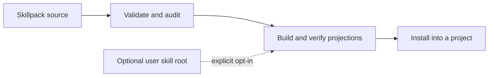

# Skills Manager

Skills Manager helps teams move AI-agent skills between projects without losing
their source, privacy, or install boundaries. Its `skill-sys` CLI validates
portable skillpacks, builds provider projections, and installs selected skills
with local checks and rollback support. The compatible `skillpool` command is
also retained.

Version **0.4.0-alpha.1** is a GitHub source alpha;
npm publication remains disabled. See the [alpha release notes](CHANGELOG.md)
for the included behavior and known limits.

## The problem it solves

Agent skills often arrive as Markdown files, but a reliable workflow also needs
to check their structure, track where they came from, choose what enters a
project, and undo an install safely. Skills Manager provides those steps while
keeping a user's private skills outside the public skillpack by default.



The public repository contains the engine, schemas, synthetic examples, and
documentation. A User Skill Root such as `~/.skill-sys` stays on the user's
machine and enters a projection only when explicitly requested.

## Try the synthetic demo

Install Bun 1.3.14 or later before running the demo. The CLI uses Bun; Node.js
and npm alone cannot execute it. Local rehearsals used Bun 1.3.14 and 1.4.2 on
Linux. Native Windows and macOS validation remains pending.

The included fixture runs locally and does not need a hosted service. From a
source checkout:

```bash
bun install --frozen-lockfile
bun run validate:skillpack
bun run build-projections
bun run validate-projections
```

The demo validates `examples/minimal-skillpack`, writes generated files under
`dist/projection-smoke`, and checks their metadata and digests. To try installation
in a disposable project inside the checkout, run these commands in the same shell:

```bash
PROJECT="$PWD/.tmp/skills-manager-demo"
mkdir -p "$PROJECT"

bun scripts/commands/skill-sys.ts build-projections \
  --source examples/minimal-skillpack \
  --providers all \
  --out-dir "$PROJECT/.skill-sys/projections" \
  --projection-store-dir "$PROJECT/.tmp/projection-store" \
  --clean

bun scripts/commands/skill-sys.ts install \
  --source examples/minimal-skillpack \
  --project "$PROJECT" \
  --projection-dir .skill-sys/projections \
  --agent codex \
  --skill example-skill

bun scripts/commands/skill-sys.ts doctor \
  --project "$PROJECT" \
  --state-safety
```

The selected skill is installed under the project's `.agents/skills`. To verify
rollback, repeat the install once to create a backup of a completed installation,
then restore it and check the resulting state:

```bash
PROJECT="$PWD/.tmp/skills-manager-demo"

bun scripts/commands/skill-sys.ts install \
  --source examples/minimal-skillpack \
  --project "$PROJECT" \
  --projection-dir .skill-sys/projections \
  --agent codex \
  --skill example-skill

bun scripts/commands/skill-sys.ts rollback \
  --project "$PROJECT" \
  --target .agents/skills

bun scripts/commands/skill-sys.ts doctor \
  --project "$PROJECT" \
  --state-safety
```

Rollback after the first installation alone has no previous managed version to
restore. The demo leaves its project and backups under `.tmp/skills-manager-demo`.

The projection directory must remain inside the selected project. User-root
skills are excluded unless a command includes `--include-user`. When enabled,
`--user-root` selects the root explicitly; otherwise the command uses
`SKILL_SYS_USER_ROOT` or the default `~/.skill-sys`.

## Alpha capabilities and limits

Local checks cover synthetic skillpack validation, projection generation and
validation, installation, state-safety checks, and rollback. The GitHub
repository is [evandro-miguel/skills-manager](https://github.com/evandro-miguel/skills-manager).
Check its release notes and Actions results for evidence at the selected revision.

Provider projections are file artifacts. Their validation does not prove that
an agent discovers, loads, or follows a skill in its live runtime.

The package keeps `private: true`, so npm publication remains disabled. The
manual npm publish workflow includes an `npm publish --provenance` path, but
trusted-publisher setup and hosted provenance have not been verified. See the
[release readiness contract](docs/release-readiness.md) for the release gates.

## Development checks

```bash
bun run typecheck
bun run test
bun run docs:check
bun run scan:privacy
bun run public:audit
bun run npm-pack-audit
```

See the [command reference](docs/reference/skill-sys-commands.md) for the CLI
and [skills.sh integration](docs/integrations/skills-sh.md) for using Skills
Manager alongside the open Agent Skills ecosystem.

## Project boundaries

- Keep private catalogs, credentials, auth state, logs, and generated
  projections out of the public package.
- Use `examples/` for synthetic skillpacks and `SKILL_SYS_USER_ROOT` for
  user-local skills.
- The owner approved this GitHub source release. npm publication remains
  separately gated and disabled.
- The package name remains `universall-skill-sys`; the public CLI names remain
  `skill-sys` and `skillpool`.

The project is licensed under MIT.
